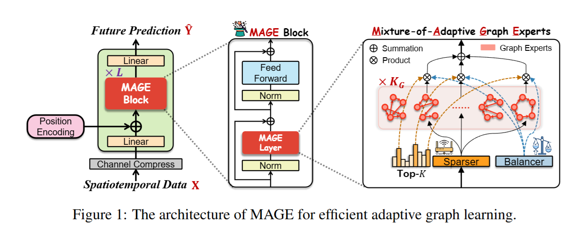
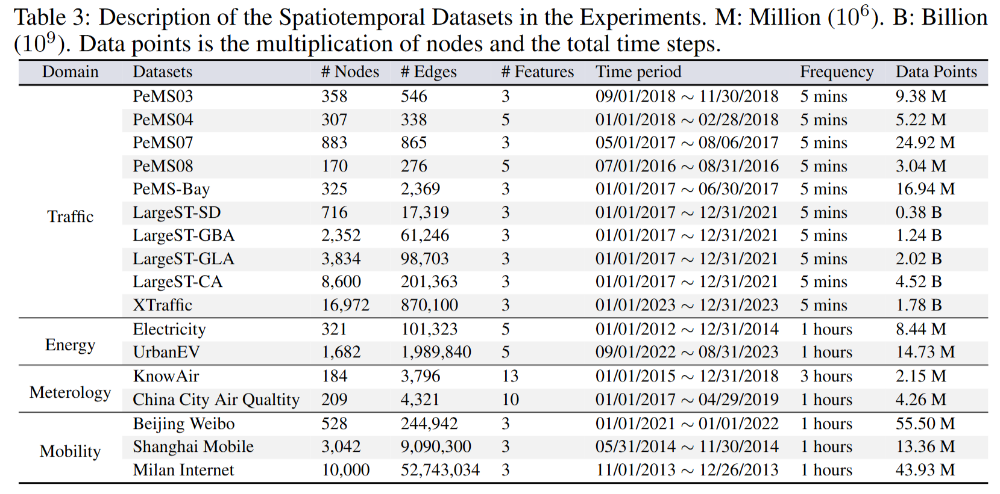
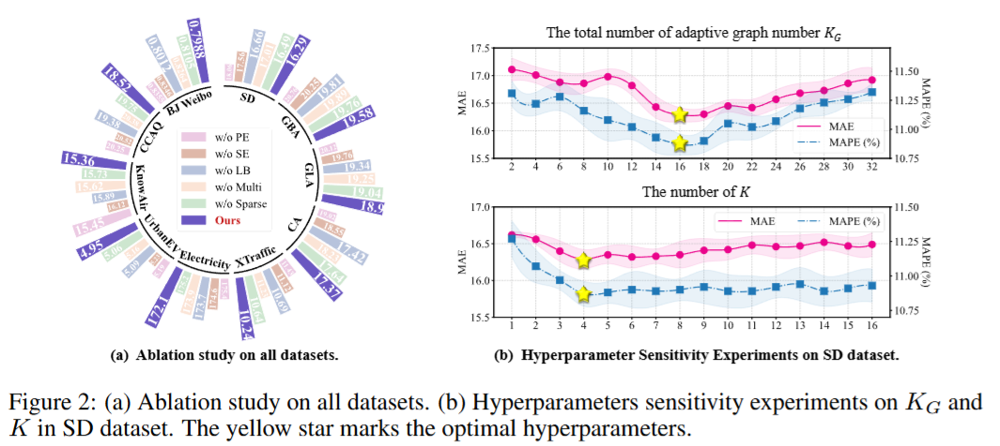
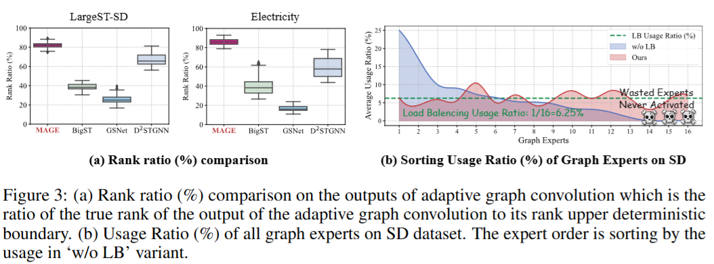
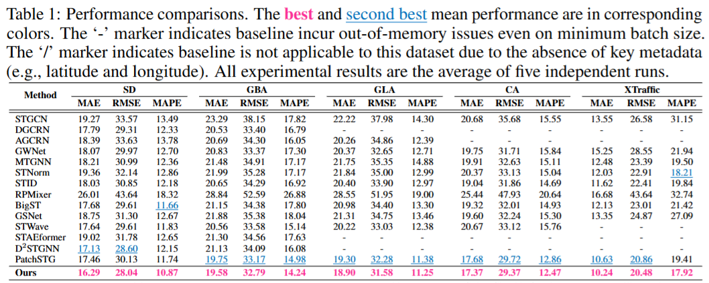

# Less but More: Linear Adaptive Graph Learning Empowering Spatiotemporal Forecasting (NeurIPS 2025)
This is the official repository one of our NeurIPS 2025 papers. The effectiveness of Spatiotemporal Graph Convolutional Networks (STGCNs) critically hinges on the quality of the underlying graph topology. While end-to-end adaptive graph learning methods have demonstrated promising results in capturing latent spatiotemporal dependencies, they often suffer from high computational complexity and limited expressive capacity. In this paper, we propose MAGE for efficient spatiotemporal forecasting. We first conduct **a theoretical analysis** demonstrating that the ReLU activation function employed in existing methods amplifies edge-level noise during graph topology learning, thereby compromising the fidelity of the learned graph structures. To enhance model expressiveness, we introduce **a sparse yet balanced mixture-of-experts strategy**, where each expert perceives the unique underlying graph through kernel-based functions and operates with linear complexity relative to the number of nodes. The sparsity mechanism ensures that each node interacts exclusively with compatible experts, while the balancing mechanism promotes uniform activation across all experts, enabling diverse and adaptive graph representations. Furthermore, we **theoretically establish that a single graph convolution using the learned graph in MAGE is mathematically equivalent to multiple convolutional steps under conventional graphs**. We evaluate MAGE against 14 state-of-the-art baselines on 17 real-world spatiotemporal datasets. **MAGE achieves SOTA performance on 94% (48/51) of the evaluation metrics.** Notably, on the SD dataset, MAGE achieves an impressive 5.15% performance improvement, while also improving memory efficiency by 10X and training efficiency by 20X.

<br>




## 1. Introduction about the datasets

We use 18 spatiotemporal datasets from four domains: **Traffic**, **Energy**, **Meteorology** and **mobile communication**. Trafffic datasets includes SD, GBA, GLA and CA in [LargeST](https://github.com/liuxu77/LargeST/blob/main), [XTraffic](https://github.com/XAITraffic/XTraffic), PeMS series: [PeMS0X (X=3,4,7,8)](https://github.com/GestaltCogTeam/BasicTS) and [PeMS-Bay](https://github.com/liyaguang/DCRNN) datasets. Energy datasets includes [Electricity](https://github.com/decisionintelligence/TFB) and [UrbanEV](https://github.com/IntelligentSystemsLab/ST-EVCDP). Mobile communication datasets include Beijing Weibo (current privacy dataset), [Shanghai Mobile](https://drive.google.com/file/d/1TWD3QDBrsn90zxbDom94BF4fR-NOp0Pi/view), and [Milan Internet](https://github.com/MohammadErfan-Jabbari/MilanTelecomDataset-Analysis). Meteorology datasets includes [KnowAir](https://github.com/shuowang-ai/PM2.5-GNN) and [China City Air Quality](https://github.com/Friger/GAGNN). 

<br>



### 1.1 Generating the sub-datasets from LargeST
We only introduce LargeST, which is the popular dataset in spatiotemporal learning here. The processing details of other datasets will be open and available after paper notification. Concretely, we use subdatasets in LargeST with year of 2019, which were followed by [LargeST](https://github.com/liuxu77/LargeST/blob/main). For example, you can download CA dataset from the provided [link](https://www.kaggle.com/datasets/liuxu77/largest) and please place the downloaded `archive.zip` file in the `data/ca` folder and unzip the file. 

First of all, you should go through a jupyter notebook `process_ca_his.ipynb` in the folder `data/ca` to process and generate a cleaned version of the flow data. Then, please go through all the cells in the provided jupyter notebooks `generate_sd_dataset.ipynb` in the folder `data/sd` and `generate_gla_dataset.ipynb` in the folder `data/gla` respectively. Finally use the commands below to generate traffic flow data for our experiments. 
```
python data/generate_data_for_training.py --dataset sd_gba --years 2019
```

<br>

## 2. Environmental Requirments
The experiment requires the same environment as [LargeST](https://github.com/liuxu77/LargeST/blob/main), and need to add the libraries mentioned in the requirements in [Knowair](https://github.com/shuowang-ai/PM2.5-GNN).

<br>







## 3. Model Running
To run MAGE on <b>LargeST</b>, for example on SD, you may directly execute the Python file in the terminal:
```
python experiments/mage/main.py --device cuda:0 --dataset sd --years 2019 --model_name mage
```

## 4. Citation
```bibtex
@inproceedings{ma2025less, 
  title     = {Less but More: Linear Adaptive Graph Learning Empowering Spatiotemporal Forecasting},
  author    = {Ma, Jiaming and Wang, Binwu and Wang, Guanjun and Yang, Kuo and Zhou, Zhengyang and Wang, Pengkun and Wang, Xu and Wang, Yang},
  booktitle = {Advances in Neural Information Processing Systems},
  year      = {2025}
}
```
